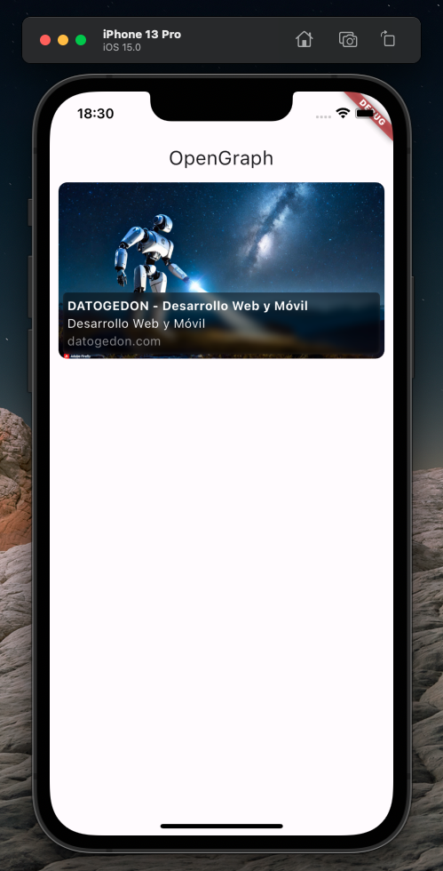

# Flutter OpenGraph Package
[](https://codecov.io/gh/baldomerocho/flutter_opengraph)

[](https://github.com/baldomerocho/flutter_opengraph/actions/workflows/release.yaml)

## What is OpenGraph?

OpenGraph is a protocol that enables any web page to become a rich object in a social graph. It was originally created by Facebook to enable web pages to have the same functionality as other Facebook objects. Today, OpenGraph is used by most social media platforms, search engines, and messaging apps to create rich previews of shared links.

## About This Package

The Flutter OpenGraph package provides a comprehensive solution for working with OpenGraph metadata in your Flutter applications. It offers dual functionality:

1. **OpengraphPreview Widget**: A customizable Flutter widget that displays beautiful link previews using OpenGraph data from any URL
2. **opengraph_fetch**: A powerful function that extracts OpenGraph metadata from URLs, supporting multiple formats

### Key Features

- **Rich Link Previews**: Transform plain URLs into engaging visual previews with title, description, and image
- **Multiple Metadata Formats**: Support for OpenGraph, Twitter Cards, HTML meta tags, and JSON-LD formats
- **Customizable UI**: Easily customize the appearance of link previews to match your app's design
- **Caching**: Efficient memory caching to avoid redundant network requests
- **Direct API Access**: Use the fetch API directly to get raw metadata for custom implementations

## Screenshots



## Installation

Add the package to your `pubspec.yaml` file:

```yaml
dependencies:
  opengraph: ^1.0.0
```

Then run:

```bash
flutter pub get
```

## Getting Started

The package offers two main components that can be used independently or together:

### 1. OpengraphPreview Widget

This widget displays a rich preview of any URL, showing the title, description, and image extracted from the OpenGraph metadata.

### 2. opengraph_fetch Function

This function extracts OpenGraph metadata from a URL and returns it as a structured object, allowing you to use the data in your own custom UI.

## Memory Management

The package includes an intelligent caching system to optimize performance and reduce network requests:

### Max Objects Configuration

You can configure the maximum number of objects that the app will store in memory to avoid excessive memory usage:

```dart
OpenGraphConfiguration(maxObjects: 1000)
```

- Objects are only available during the session (ephemeral memory)
- The cache uses a first-in-first-out (FIFO) approach when the limit is reached
- This prevents redundant network requests for previously fetched URLs

## Usage

### Configuration

First, initialize the configuration with the maximum number of objects to store in memory:

```dart
class OpenGraphProvider {
  static OpenGraphConfiguration CONFIG = OpenGraphConfiguration(
      maxObjects: 1000
  );
}

main() async {
  WidgetsFlutterBinding.ensureInitialized();
  // Initialize the provider
  OpenGraphRequest().initProvider(OpenGraphProvider.CONFIG);
  runApp(const MyApp());
}
```

### Using the OpengraphPreview Widget

The widget allows you to preview OpenGraph data from a URL with various customization options:

```dart
OpengraphPreview(
  url: "https://www.youtube.com/watch?v=6g4dkBF5anU",
  height: 200,                           // Optional: Custom height for the preview
  borderRadius: 10,                      // Optional: Rounded corners radius
  backgroundColor: Colors.black87,       // Optional: Background color
  progressColor: Colors.white54,         // Optional: Loading indicator color
)
```

#### Customization Options

The `OpengraphPreview` widget supports the following customization options:

| Parameter | Type | Description |
|-----------|------|-------------|
| `url` | String | The URL to fetch OpenGraph data from (required) |
| `height` | double | Height of the preview card (default: 150) |
| `borderRadius` | double | Radius for the card corners (default: 8) |
| `backgroundColor` | Color | Background color of the card (default: white) |
| `progressColor` | Color | Color of the loading indicator (default: grey) |

#### Styling Examples

**Dark Theme:**
```dart
OpengraphPreview(
  url: "https://flutter.dev",
  height: 200,
  borderRadius: 16,
  backgroundColor: Colors.black87,
  progressColor: Colors.white54,
)
```

**Rounded Corners:**
```dart
OpengraphPreview(
  url: "https://pub.dev/packages/opengraph",
  height: 180,
  borderRadius: 24,
  backgroundColor: Color(0xFFE0F7FA),
  progressColor: Colors.teal,
)
```

### Using the opengraph_fetch Function

You can directly fetch OpenGraph metadata from any URL and use it in your own custom UI:

```dart
// Fetch OpenGraph data
final openGraphData = await opengraph_fetch("https://github.com/baldomerocho/flutter_opengraph");

// Access the structured data
print(openGraphData?.title);        // Title of the page
print(openGraphData?.description);  // Description of the page
print(openGraphData?.image);        // Featured image URL
print(openGraphData?.url);          // Canonical URL
print(openGraphData?.siteName);     // Site name
print(openGraphData?.type);         // Content type (e.g., "website", "article")
print(openGraphData?.locale);       // Content locale (e.g., "en_US")
```

#### Raw Metadata Access

For advanced use cases, you can also access the raw metadata:

```dart
// Fetch raw OpenGraph data
final rawData = await opengraph_fetch_raw("https://datogedon.com");

// Access the raw data
print(rawData?.title);
print(rawData?.description);
// ... other properties
```

### Supported Metadata Formats

The package can extract metadata from multiple formats:

1. **OpenGraph Protocol**: Standard `og:` meta tags (Facebook, most social platforms)
2. **Twitter Cards**: Twitter-specific metadata format
3. **HTML Meta Tags**: Standard HTML meta tags for title, description, etc.
4. **JSON-LD**: Structured data in JSON-LD format (commonly used for SEO)

The extraction process follows a priority order, with OpenGraph tags taking precedence when available, followed by Twitter Cards, then standard HTML meta tags, and finally JSON-LD.

### Complete Example

```dart
import 'package:flutter/material.dart';
import 'package:opengraph/opengraph.dart';

class OpenGraphProvider {
  static OpenGraphConfiguration CONFIG = OpenGraphConfiguration(
      maxObjects: 1000
  );
}

main() async {
  WidgetsFlutterBinding.ensureInitialized();
  // Initialize the provider
  OpenGraphRequest().initProvider(OpenGraphProvider.CONFIG);
  runApp(const MyApp());
}

class MyApp extends StatelessWidget {
  const MyApp({super.key});

  @override
  Widget build(BuildContext context) {
    return MaterialApp(
      home: Scaffold(
        appBar: AppBar(
          title: const Text('OpenGraph Preview'),
        ),
        body: Column(
          children: [
            // Example of using the OpengraphPreview widget
            const Padding(
              padding: EdgeInsets.all(8.0),
              child: OpengraphPreview(
                url: "https://www.youtube.com/watch?v=6g4dkBF5anU",
              ),
            ),
            
            // Example of using the opengraph_fetch functionality
            FutureBuilder(
              future: opengraph_fetch("https://github.com/baldomerocho/flutter_opengraph"),
              builder: (context, snapshot) {
                if (snapshot.connectionState == ConnectionState.waiting) {
                  return const CircularProgressIndicator();
                }
                if (snapshot.hasError || !snapshot.hasData) {
                  return const Text("Error fetching data");
                }
                final data = snapshot.data!;
                return Padding(
                  padding: const EdgeInsets.all(8.0),
                  child: Card(
                    child: Padding(
                      padding: const EdgeInsets.all(8.0),
                      child: Column(
                        crossAxisAlignment: CrossAxisAlignment.start,
                        mainAxisSize: MainAxisSize.min,
                        children: [
                          Text("Title: ${data.title}", style: Theme.of(context).textTheme.titleMedium),
                          Text("Description: ${data.description}"),
                          if (data.image.isNotEmpty)
                            Image.network(data.image, height: 100),
                        ],
                      ),
                    ),
                  ),
                );
              },
            ),
          ],
        ),
      ),
    );
  }
}

## Advanced Usage

### Combining Both Features

You can use both the widget and fetch functionality together in your app. For example, you might want to display a preview widget but also use the metadata for other purposes:

```dart
FutureBuilder(
  future: opengraph_fetch("https://flutter.dev"),
  builder: (context, snapshot) {
    if (snapshot.connectionState == ConnectionState.waiting) {
      return const CircularProgressIndicator();
    }
    
    // Display the preview widget
    return Column(
      children: [
        // Use the widget for visual preview
        const OpengraphPreview(url: "https://flutter.dev"),
        
        // Also use the fetched data for other purposes
        if (snapshot.hasData)
          Text("This content is from: ${snapshot.data!.siteName}"),
      ],
    );
  },
)
```

### Error Handling

The package includes built-in error handling to ensure your app remains stable even when URLs are invalid or content cannot be fetched:

```dart
try {
  final data = await opengraph_fetch("https://invalid-url.example");
  // Handle success case
} catch (e) {
  // Handle error case
  print("Error fetching OpenGraph data: $e");
}
```

## Best Practices

### Performance Optimization

1. **Configure Cache Size**: Set an appropriate `maxObjects` value based on your app's memory constraints
2. **Lazy Loading**: Use the OpengraphPreview widget in scrollable lists with lazy loading
3. **Prefetching**: Consider prefetching OpenGraph data for important links that users are likely to interact with

### UI Integration

1. **Fallback UI**: Always provide fallback UI for cases where OpenGraph data might be missing
2. **Loading States**: Show appropriate loading indicators while data is being fetched
3. **Error States**: Handle error states gracefully with user-friendly messages

## Contribution

Contributions are welcome! If you find any issues or have suggestions for improvements, please feel free to open an issue or submit a pull request on the [GitHub repository](https://github.com/baldomerocho/flutter_opengraph).

## License

This package is available under the MIT License.